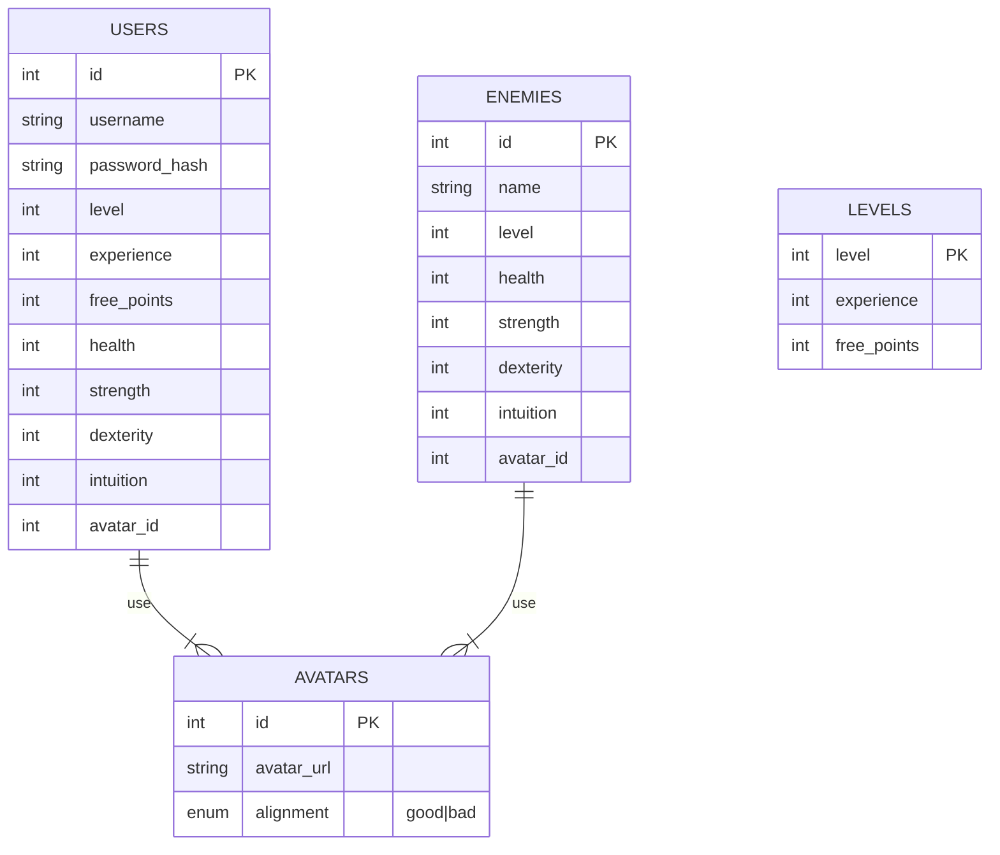

## The game Fighter 

### Wireframe

### Backlog
https://github.com/users/arkadiyshin/projects/7/

### API 

### USERS

#### POST /users/signup
body {
  username,
  password
}

response {
  201: created
}  
  
#### POST /users/login
body {
  username,
  password
}

response {
  201: created
}  

#### GET /users/:id

responce {
  username,
  level,
  experience,
  free_points,
  health,
  strength,
  dexterity,
  intuition,
  avatar
}

#### PUT /users/:id/profile

body{
  avatar_id,
}

#### PUT /users/:id/skills

body{
  free_points,
  health,
  strength,
  dexterity,
  intuition,
}

### GAME

#### GET /games/start
query{
  level_min,
  level_max
}

responce{
  enemy_name,
  enemy_level,
  enemy_health,
  enemy_strength,
  enemy_dexterity,
  enemy_intuition,
  enemy_avatar_url
}

#### POST /games/finish/:player_id

body{
  player_id,
  player_health,
  enemy_id,
  enemy_health
}

responce{
  experince,
  level,
  free_points
}

### AVATARS

#### GET /avatars/
{
  id,
  avatar_url
}

### External API 

https://akabab.github.io/superhero-api/

### ER Diagram

