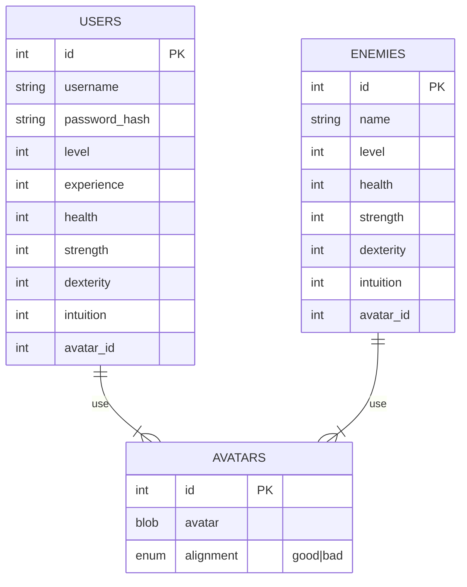

## The game Fighter 

### Wireframe

### Backlog
https://github.com/users/arkadiyshin/projects/7/

### API 

https://akabab.github.io/superhero-api/

### ER Diagram

```mermaid
erDiagram

USERS ||--|{ AVATARS : "use"
ENEMIES ||--|{ AVATARS : "use"

USERS{
  int id PK
  string username
  string password_hash
  int level
  int experience
  int health
  int strength
  int dexterity
  int intuition
  int avatar_id
}

ENEMIES{
  int id PK
  string name
  int level
  int health
  int strength
  int dexterity
  int intuition
  int avatar_id
}

AVATARS{
  int id PK
  blob avatar
  enum alignment "good|bad"
}

```
