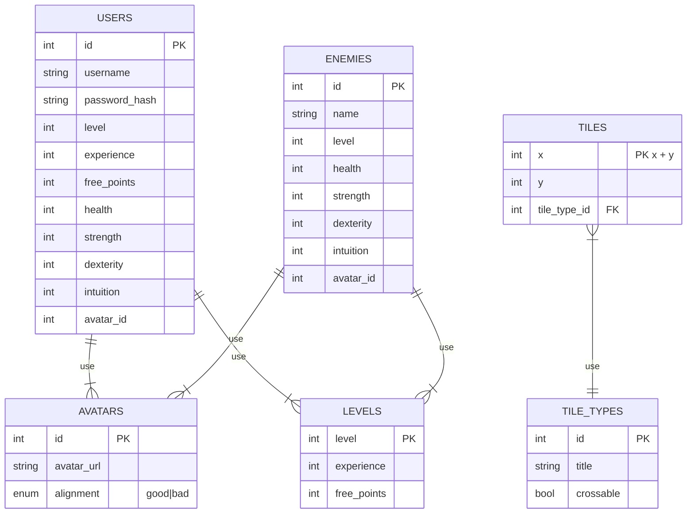

## The game Fighter 

### Wireframe

### Backlog
https://github.com/users/arkadiyshin/projects/7/

### External API 

https://akabab.github.io/superhero-api/

### ER Diagram

### API 

### USERS

#### POST /users/signup
> - body
>   - username
>   - password

> - response
>   - 201: created
  
  
#### POST /users/login
> - body
>   - username
>   - password

> - response
>   - 202: success

#### GET /users/:id
> - responce 
>   - 200:
>   - username
>   -  evel
>   - experience
>   - free_points
>   - health
>   - strength
>   - dexterity
>   - intuition  
>   - avatar

#### PUT /users/:id/profile
> - body
>   - avatar_id

> - responce
>   - 202: success
>   

#### PUT /users/:id/skills
> - body
>   - free_points
>   - health
>   - strength
>   - dexterity
>   - intuition
  
> - responce
>   - 202: success

### GAME

#### GET /games/start
> - query
>   - level_min
>   - level_max

> - responce
>   - 200:
>   - enemy_name
>   - enemy_level
>   - enemy_health
>   - enemy_strength
>   - enemy_dexterity
>   - enemy_intuition
>   - enemy_avatar_url
>   

#### POST /games/finish/:player_id
> - body
>   - player_id
>   - player_health
>   - enemy_id
>   - enemy_health

> - responce
>   - 202:
>   - experince
>   - level
>   - free_points

### AVATARS

#### GET /avatars/
> - responce 
>   - 200:
>   - id
>   - avatar_url
